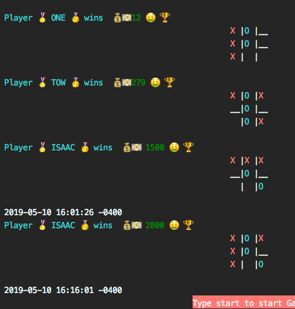

# Tic Tac Toe
Remember Tic Tac Toe? See Wikipedia if you can’t remember the rules, or if you haven’t ever played. It involves a couple of players, a simple board, checking for victory in a game loop… all the conditions that make it a fun little problem to solve using our newfound OOP sea legs. Let’s build it!

## Created by [Isaac](http://github.com/Ispirett) and [Armando](http://github.com/Macatuz)

# Installation
* Open your terminal
* Type "git clone https://github.com/Ispirett/tic-tac-toe" and press ENTER
* Type "cd tic-tac-toe" and press ENTER
* Type "cd bin" and press ENTER
* Type "ruby start_game.rb" and press ENTER
* There you go n.n have some fun.

# Features
* Score Tracker Feature

  
        
  Once the game is finish you will find => "Thanks for Playing" and ""Type start to start Game , S to See Score History or Help for instructions or E to exit game""
    
  * Type S and press ENTER to see the score.
  
* Betting Feature

  Once the game is open, there should be this => "Type start to start Game , S to See Score History or Help for instructions or E to exit game"

  * Type "start" and press ENTER

  Once you got here, there should be this => "Player (1) Enter your name" as well the player 2 will be asked for his name.

  * Type Player 1 name and press ENTER
  * Type Player 2 name and press ENTER
  
  Once there are both players in, there should be this => "Player enter bet amount" as well the player 2 will be asked for his amount.

  * Type Player 1 amount and press ENTER
  * Type Player 2 amount and press ENTER

# Playing Guide
Once the game is open, there should be this => "Type start to start Game , S to See Score History or Help for instructions or E to exit game"

* Type "start" and press ENTER

Once you got here, there should be this => "Player (1) Enter your name" as well the player 2 will be asked for his name.

* Type Player 1 name and press ENTER
* Type Player 2 name and press ENTER

Once there are both players in, then the game will start looping turns and you will find =>  "Player 1 turn to play enter word ranging from one to nine"

* Type a number  between 1 and 9 using letters. like => one, two, three

This will choose two positions using  x = input / 3 and y = input % 3 and will let the program know where to choose over the 3x3 board and finally check it with the player "X" or "O" and keep doing this till game is over.

Once you get to finish one round you will find => "Thanks for Playing" and ""Type start to start Game , S to See Score History or Help for instructions or E to exit game""

* Type S and press ENTER to see the score.
* Type Help and press ENTER to see instruccions
* Type E and press ENTER to quit the game.

# Rules
* Never skip player turns, the game says who is going to play.
* Have some fun n.n.
